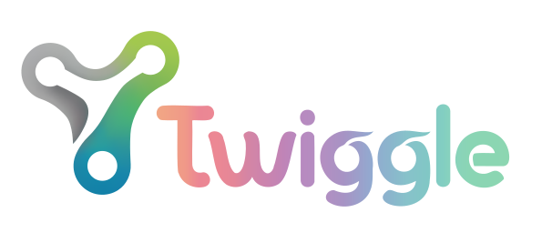

  

## About Us

Twiggle Labs is committed to transforming how students learn. Our mission is to make education more adaptive, engaging and effective through the use of artificial intelligence. We believe every student learns differently - with the right tools, every student can succeed.

## Our Product – Twiggle

Twiggle is an AI-powered e-learning platform designed for students in Grades 3 through 8. It offers a personalized learning environment that adapts to each learner’s pace, style and understanding.

### Key Features

* **Smart Content**: Curriculum-aligned lessons enriched with visuals and interactive elements.
* **Adaptive Learning Paths**: Learning journeys that evolve in response to student performance and behaviour.
* **Progress Insights**: Real-time dashboards for students, parents and educators to monitor progress and engagement.
* **Practice & Evaluation**: Intelligent quizzes and assessments that reinforce learning and identify gaps.

## Who We Serve

* Students in Grades 3–8 seeking to strengthen understanding through guided, engaging ‘smart’ content.
* Parents who want visibility into their child’s academic progress and personalised support.
* Schools and educators looking to integrate AI-enhanced tools into their classrooms.

## Our Vision

We aim to create a world where learning feels intuitive, technology supports rather than distracts, and education becomes truly personal.

## Explore More

Visit our website for more details: [Twiggle Labs](https://lively-forest-0a14df900.1.azurestaticapps.net/)

For inquiries: [twigglelabs@gmail.com](mailto:twigglelabs@gmail.com)
